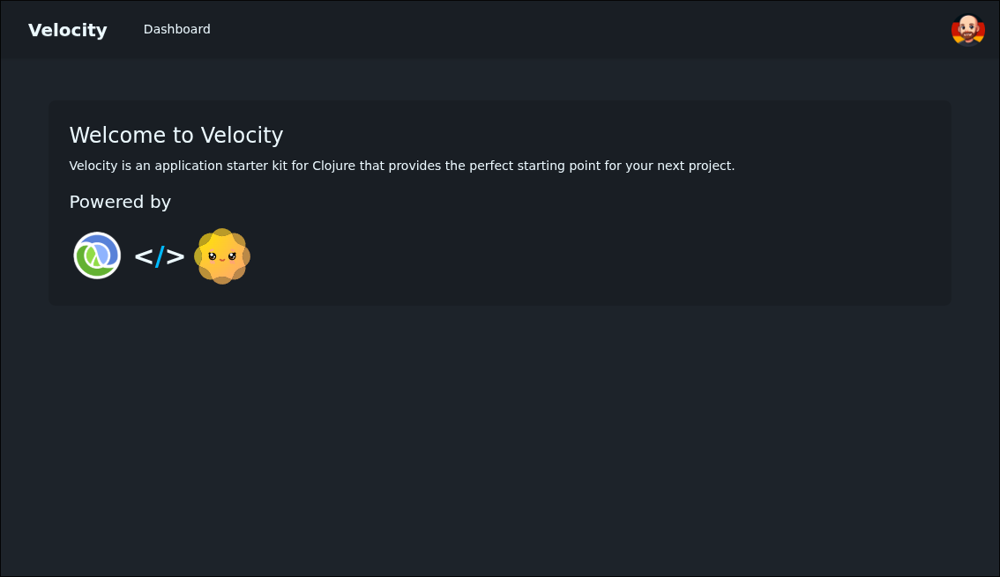
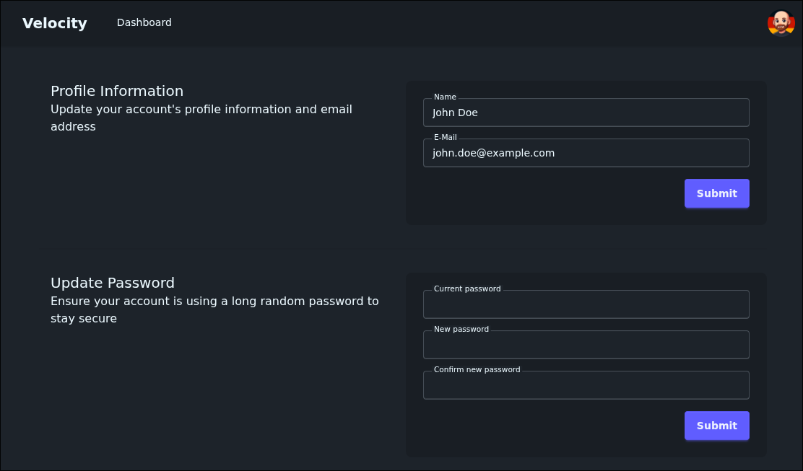

# velocity

Velocity is an application starter kit for Clojure that provides the perfect starting point for your next project.

Inspired by [Laravel Jetstream](https://jetstream.laravel.com/)

Powered by [Clojure](https://clojure.org), [HTMX](https://htmx.org) and [DaisyUI](https://daisyui.com)

## Features

- Application login, registration and email verification
- User settings page, with the ability to change name, email address and password
- Session management
- Pretty DaisyUI powered interface
- Easy deployment via Docker or Uberjar





## Deploy

### Docker

```bash
# build the project
$ docker build -t velocity .

# run the project, if using with SQLite don't forget to map a volume to /app/data
$ docker run --rm -p 3000:3000 -v ./data:/app/data -e APP_REGISTER_ENABLED=true velocity

# The website is now available at localhost:3000
```

### Uberjar

```bash
# build css
$ npm run build

# just build the uberjar using leiningen
$ lein uberjar

# execute the jar
$ APP_REGISTER_ENABLED=true java -jar ./target/uberjar/velocity-VERSION-standalone.jar

# The website is now available at localhost:3000
```

## License

MIT
